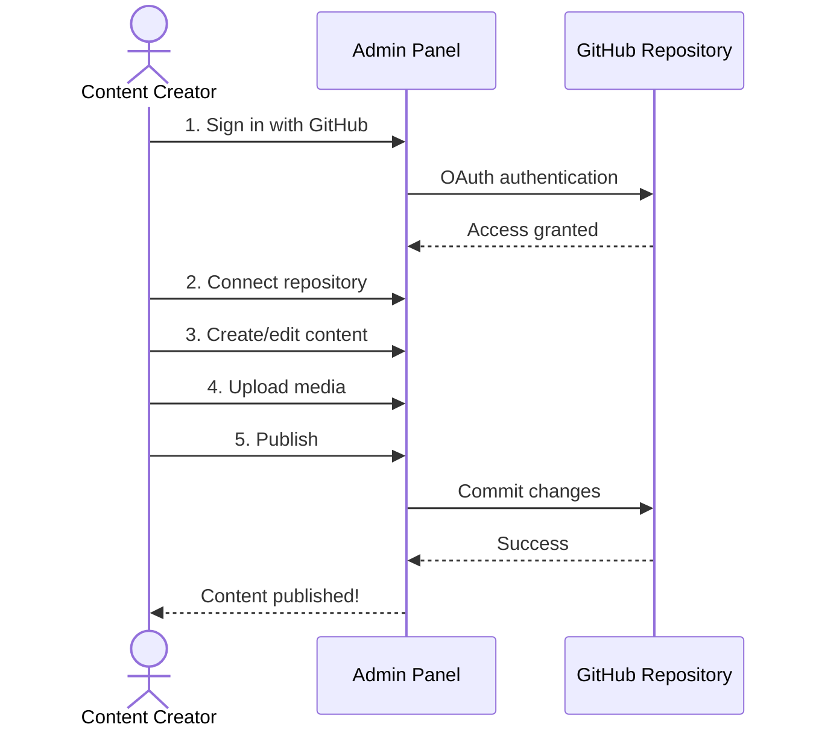

# Admin Panel Overview

The GitCMS Admin Panel is a universal web application that provides a visual
interface for managing content stored in GitHub repositories.

## What is the Admin Panel?

Think of it as **WordPress for GitHub**. A beautiful, hosted interface that lets
you create and manage content without touching code, while everything is stored
in your GitHub repository.

**Access**: [gitcms-admin.bestplayer.dev](https://gitcms-admin.bestplayer.dev)

## Key Features

### 🎨 Visual Content Editor

- Rich text editing powered by TipTap
- Markdown support
- Live preview
- Syntax highlighting for code blocks
- Tables, lists, headings, and more

### 🖼️ Media Management

- Drag & drop upload
- Support for images, videos, audio, documents
- Automatic organization by type
- Preview and selection interface
- Git LFS integration for large files

### 📋 Schema Designer

- Visual schema builder
- Multiple field types (string, number, date, media, etc.)
- Nested objects and arrays
- Field validation
- Required/optional fields

### 🔐 Secure Authentication

- GitHub OAuth integration
- Works with private repositories
- Secure token handling
- Session management
- No credentials stored

### 📊 Content Management

- Create, edit, delete content
- Draft, Published, Archived statuses
- Content history via Git
- Search and filter
- Bulk operations

## Who Should Use It?

### Content Creators

Perfect for those who want to:

- ✅ Create content visually
- ✅ Avoid editing raw files
- ✅ Upload media easily
- ✅ Preview before publishing
- ✅ Track changes with Git

### Bloggers

- Write posts with rich formatting
- Add featured images
- Manage tags and categories
- Schedule publications
- Track post history

### Marketing Teams

- Update website content independently
- Create landing pages
- Manage product descriptions
- Upload marketing materials
- No developer dependency

### Documentation Teams

- Maintain documentation visually
- Organize content by categories
- Embed images and videos
- Version control built-in
- Collaborative editing

## Benefits

### No Installation

- Hosted service - just sign in
- No software to install
- No updates to manage
- Works on any device
- Always latest version

### Universal Interface

- One admin panel for all repositories
- Switch between repos easily
- Consistent experience
- No per-repo setup

### Git-Powered

- Every change is a commit
- Full version history
- Revert anytime
- Collaborate with team
- Branch workflows

### Zero Infrastructure

- No servers to maintain
- No databases to manage
- Content stored in GitHub (free)
- Automatic backups
- High availability

## How It Works



## Main Features

### 1. Repository Connection

- Connect any public or private repository
- Select branch (main, develop, etc.)
- Automatic `.gitcms` folder creation
- Initial configuration setup

### 2. Schema Management

Define content types with fields:

- **String**: Short text (titles, names)
- **Text**: Long text (descriptions)
- **Markdown**: Rich content with formatting
- **Number**: Integers or decimals
- **Boolean**: True/false checkboxes
- **Date/DateTime**: Date pickers
- **Media**: Images, videos, documents
- **Array**: Lists of items
- **Object**: Nested data structures

### 3. Content Creation

- Form-based content entry
- Rich text editor for Markdown fields
- Media picker for uploads
- Auto-save drafts
- Validation before publish

### 4. Media Library

- Upload via drag & drop or file picker
- Automatic organization by type
- Search and filter media
- Preview before inserting
- Copy URLs for manual use

### 5. Version History

Every change tracked in Git:

- See all commits for a file
- View diffs between versions
- Revert to previous versions
- Author and timestamp info

## Quick Tour

### Dashboard

The main hub showing:

- Recent content items
- Quick stats
- Repository info
- Quick actions

### Content List

Browse all content:

- Filter by schema type
- Search by title
- Sort by date
- Status indicators (draft/published)
- Bulk actions

### Content Editor

Create and edit content:

- Form fields based on schema
- Rich text editor
- Media selector
- Preview mode
- Draft/Publish controls

### Schemas

Manage content types:

- Create new schemas
- Edit existing schemas
- View schema usage
- Delete schemas

### Media Library

Manage uploads:

- Upload new files
- Browse by type
- Search media
- View details
- Delete files

### Settings

Configure your setup:

- Repository settings
- Branch selection
- User preferences
- Schema management

## User Interface

### Navigation

```
┌─────────────────────────────────────────┐
│  GitCMS Admin            [User Menu]    │
├─────────────────────────────────────────┤
│  📊 Dashboard                           │
│  📝 Content                             │
│  🗂️  Schemas                            │
│  🖼️  Media                              │
│  ⚙️  Settings                           │
└─────────────────────────────────────────┘
```

### Content Editor

```
┌─────────────────────────────────────────┐
│  [Back] New Blog Post          [Save]   │
├─────────────────────────────────────────┤
│  Title: [                           ]   │
│                                         │
│  Content: [Rich Text Editor        ]   │
│           [Formatting toolbar      ]   │
│           [                        ]   │
│                                         │
│  Featured Image: [Choose Media]        │
│                                         │
│  Published Date: [Date Picker]         │
│                                         │
│  Tags: [tag1] [tag2] [+]               │
│                                         │
│  [Save as Draft]  [Publish]            │
└─────────────────────────────────────────┘
```

## Getting Started

Ready to start creating content?

::: info Next Steps

1. [Authentication](/admin/authentication) - Sign in with GitHub
2. [Repository Setup](/admin/repository-setup) - Connect your repo
3. [Create Schemas](/admin/schemas) - Define content types
4. [Create Content](/admin/creating-content) - Start creating!

:::

## Common Workflows

### Write a Blog Post

1. Navigate to Content → Create New
2. Select "Blog Post" schema
3. Fill in title and content
4. Upload featured image
5. Add tags
6. Click "Publish"

### Update Documentation

1. Navigate to Content
2. Find the doc to update
3. Click to edit
4. Make changes in editor
5. Preview changes
6. Save changes

### Upload Media

1. Navigate to Media Library
2. Drag files or click Upload
3. Files organized automatically
4. Use in content via media picker

### Create Content Type

1. Navigate to Schemas
2. Click "Create New Schema"
3. Add fields with types
4. Configure validation
5. Save schema

## Tips for Success

### Content Writing

✅ **Do**:

- Use descriptive titles
- Add metadata (tags, dates)
- Preview before publishing
- Use appropriate media

❌ **Don't**:

- Forget to save drafts
- Skip metadata fields
- Upload huge files without LFS

### Media Management

✅ **Do**:

- Optimize images before upload
- Use descriptive filenames
- Add alt text for accessibility
- Organize with folders

❌ **Don't**:

- Upload raw camera files
- Use spaces in filenames
- Forget to compress videos

### Schema Design

✅ **Do**:

- Plan schema structure first
- Use appropriate field types
- Mark required fields
- Add helpful descriptions

❌ **Don't**:

- Delete schemas with content
- Frequently change field types
- Use overly complex structures

## Need Help?

- [Getting Started Guide](/admin/getting-started)
- [Troubleshooting](/admin/troubleshooting)
- [GitHub Issues](https://github.com/BestPlayerMMIII/GitCMS/issues)

## What's Next?

Start using the Admin Panel:

<div class="vp-doc">
  <a href="/admin/getting-started" class="vp-button brand">Get Started</a>
  <a href="https://gitcms-admin.bestplayer.dev" class="vp-button alt" style="margin-left: 1rem;">Open Admin Panel</a>
</div>
