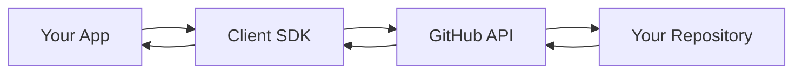

# Client SDK Overview

The `@git-cms/client` is a TypeScript SDK that lets you fetch content from
GitHub repositories managed with GitCMS.

## What is the Client SDK?

A powerful, type-safe library for integrating GitCMS content into your
applications. Think of it as your **content API powered by GitHub**.

**Package**: `@git-cms/client` on npm

## Key Features

### 🚀 Zero Backend Required

For public repositories, fetch content directly from GitHub - no server needed!

### 🔐 Private Repository Support

Use authentication tokens for private repos (server-side only).

### 📝 Type-Safe API

Full TypeScript support with comprehensive types and auto-completion.

### 🔍 Powerful Queries

SQL-like query interface with filtering, sorting, and nested field access.

### 🖼️ Progressive Media Loading

Fast thumbnails instantly, high-resolution images loaded asynchronously.

### ⚡ Framework Agnostic

Works with React, Vue, Next.js, Astro, vanilla JS, and more.

### 🎯 Two Transport Modes

- **Public Mode**: 60 req/hr, no token needed
- **Authenticated Mode**: 5,000 req/hr, requires token

## Quick Example

```typescript
import { GitCMS } from '@git-cms/client';

// Initialize
const cms = new GitCMS({
  repository: 'username/my-blog',
});

// Fetch published posts
const posts = await cms
  .from('posts')
  .where('metadata.status', '==', 'published')
  .orderBy('metadata.publishedAt', 'desc')
  .limit(10)
  .get();

// Display
posts.forEach(post => {
  console.log(post.data.title, post.metadata.publishedAt);
});
```

## Use Cases

### Blog Websites

Fetch and display blog posts with rich content and media.

### Documentation Sites

Keep docs up-to-date with easy content management.

### Portfolio Sites

Showcase projects with dynamic content from GitHub.

### Mobile Apps

Fetch configuration and content without app updates.

### E-commerce Catalogs

Display product information (content only, not transactions).

## Architecture



## Getting Started

Ready to integrate GitCMS?

::: info Next Steps

1. [Installation](/client/installation) - Install the SDK
2. [Quick Start](/client/quick-start) - First queries
3. [Configuration](/client/configuration) - Setup options

:::

## What's Next?

<div class="vp-doc">
  <a href="/client/installation" class="vp-button brand">Get Started</a>
  <a href="/client/quick-start" class="vp-button alt" style="margin-left: 1rem;">Quick Start</a>
</div>
