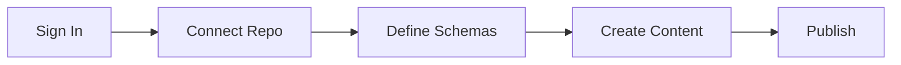
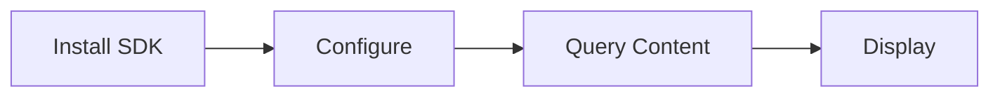

# Getting Started

Get up and running with GitCMS in minutes. Choose your path based on your role.

## Choose Your Path

<div class="tip custom-block" style="padding-top: 8px">

### I want to create content

Use the **Admin Panel** to manage content visually without touching code.

👉 [Go to Admin Panel Guide](/admin/getting-started)

</div>

<div class="tip custom-block" style="padding-top: 8px">

### I want to build an application

Use the **Client SDK** to fetch content from GitHub in your projects.

👉 [Go to Client SDK Guide](/client/quick-start)

</div>

## Prerequisites

### For Content Creators (Admin Panel)

- A GitHub account
- A GitHub repository (public or private)
- Basic understanding of content structure

**That's it!** No installation or technical setup required.

### For Developers (Client SDK)

- Node.js 18 or higher
- Basic understanding of JavaScript/TypeScript
- A project to integrate GitCMS into

## Quick Overview

### Admin Panel Workflow



1. **Sign in** with GitHub OAuth
2. **Connect** your repository
3. **Define** content schemas
4. **Create** and manage content
5. **Publish** to GitHub

[Detailed Admin Guide →](/admin/getting-started)

### Client SDK Workflow



1. **Install** `@git-cms/client`
2. **Configure** with repository
3. **Query** content with filters
4. **Display** in your application

[Detailed Client Guide →](/client/quick-start)

## Installation

### Admin Panel

No installation needed! Just visit:

**🔗 [gitcms-admin.bestplayer.dev](https://gitcms-admin.bestplayer.dev)**

### Client SDK

Install via npm:

```bash
npm install @git-cms/client
```

Or with other package managers:

::: code-group

```bash [npm]
npm install @git-cms/client
```

```bash [yarn]
yarn add @git-cms/client
```

```bash [pnpm]
pnpm add @git-cms/client
```

:::

## First Steps

### As a Content Creator

1. **Visit the Admin Panel**
   - Go to [gitcms-admin.bestplayer.dev](https://gitcms-admin.bestplayer.dev)
   - Click "Sign in with GitHub"

2. **Connect Your Repository**
   - Select an existing repository or create a new one
   - Choose the branch (usually `main`)
   - Click "Connect"

3. **Create Your First Schema**
   - Navigate to "Schemas"
   - Click "Create New Schema"
   - Define fields (title, content, etc.)
   - Save schema

4. **Create Content**
   - Navigate to "Content"
   - Click "Create New"
   - Select your schema
   - Fill in the form
   - Publish!

[Complete Admin Tutorial →](/admin/getting-started)

### As a Developer

1. **Install the SDK**

   ```bash
   npm install @git-cms/client
   ```

2. **Initialize GitCMS**

   ```typescript
   import { GitCMS } from '@git-cms/client';

   const cms = new GitCMS({
     repository: 'username/my-blog',
   });
   ```

3. **Fetch Content**

   ```typescript
   const posts = await cms
     .from('posts')
     .where('metadata.status', '==', 'published')
     .get();
   ```

4. **Display Content**
   ```typescript
   posts.forEach(post => {
     console.log(post.data.title);
   });
   ```

[Complete SDK Tutorial →](/client/quick-start)

## Example Projects

### Blog Website

Use GitCMS to power a blog:

```typescript
// Fetch recent posts
const posts = await cms
  .from('posts')
  .where('metadata.status', '==', 'published')
  .orderBy('metadata.publishedAt', 'desc')
  .limit(10)
  .get();

// Display posts
posts.forEach(post => {
  console.log(`${post.data.title} - ${post.metadata.publishedAt}`);
});
```

### Portfolio Site

Manage projects with GitCMS:

```typescript
// Fetch featured projects
const projects = await cms
  .from('projects')
  .where('featured', true)
  .orderBy('order', 'asc')
  .get();
```

### Documentation Site

Keep docs organized:

```typescript
// Fetch docs by category
const guides = await cms
  .from('docs')
  .where('category', '==', 'guides')
  .orderBy('order', 'asc')
  .get();
```

## Repository Structure

After setup, your repository will look like this:

```
your-repository/
├── .gitcms/
│   ├── config.json           # GitCMS configuration
│   └── schemas/              # Content type definitions
│       ├── blog-post.json
│       └── project.json
├── content/                  # Your content files
│   ├── posts/
│   │   ├── my-first-post.md
│   │   └── another-post.json
│   └── projects/
│       └── awesome-project.json
└── media/                    # Uploaded media files
    ├── images/
    └── videos/
```

## Configuration Files

### .gitcms/config.json

Basic GitCMS configuration:

```json
{
  "version": "1.0",
  "contentPath": "content",
  "mediaPath": "media",
  "schemasPath": ".gitcms/schemas"
}
```

### Schema Example

Define content structure:

```json
{
  "id": "blog-post",
  "name": "Blog Post",
  "description": "Blog article with rich content",
  "fields": [
    {
      "name": "title",
      "type": "string",
      "required": true
    },
    {
      "name": "content",
      "type": "markdown",
      "required": true
    },
    {
      "name": "publishedAt",
      "type": "datetime"
    }
  ]
}
```

## Next Steps

Now that you have a basic understanding:

::: info For Content Creators

Learn how to use the Admin Panel effectively

- [Repository Setup](/admin/repository-setup)
- [Creating Schemas](/admin/schemas)
- [Managing Content](/admin/creating-content)
- [Media Management](/admin/media-management)

:::

::: info For Developers

Learn how to integrate GitCMS into your apps

- [Configuration](/client/configuration)
- [Querying Content](/client/basic-queries)
- [Media Management](/client/media)
- [Framework Integration](/client/nextjs)

:::

## Need Help?

- **Documentation**: Browse guides in the sidebar
- **GitHub Issues**:
  [Report bugs](https://github.com/BestPlayerMMIII/GitCMS/issues)
- **Discussions**:
  [Ask questions](https://github.com/BestPlayerMMIII/GitCMS/discussions)

## What's Next?

Choose your learning path:

<div class="vp-doc">
  <a href="/admin/getting-started" class="vp-button brand">Admin Panel Guide</a>
  <a href="/client/quick-start" class="vp-button brand" style="margin-left: 1rem;">Client SDK Guide</a>
</div>
