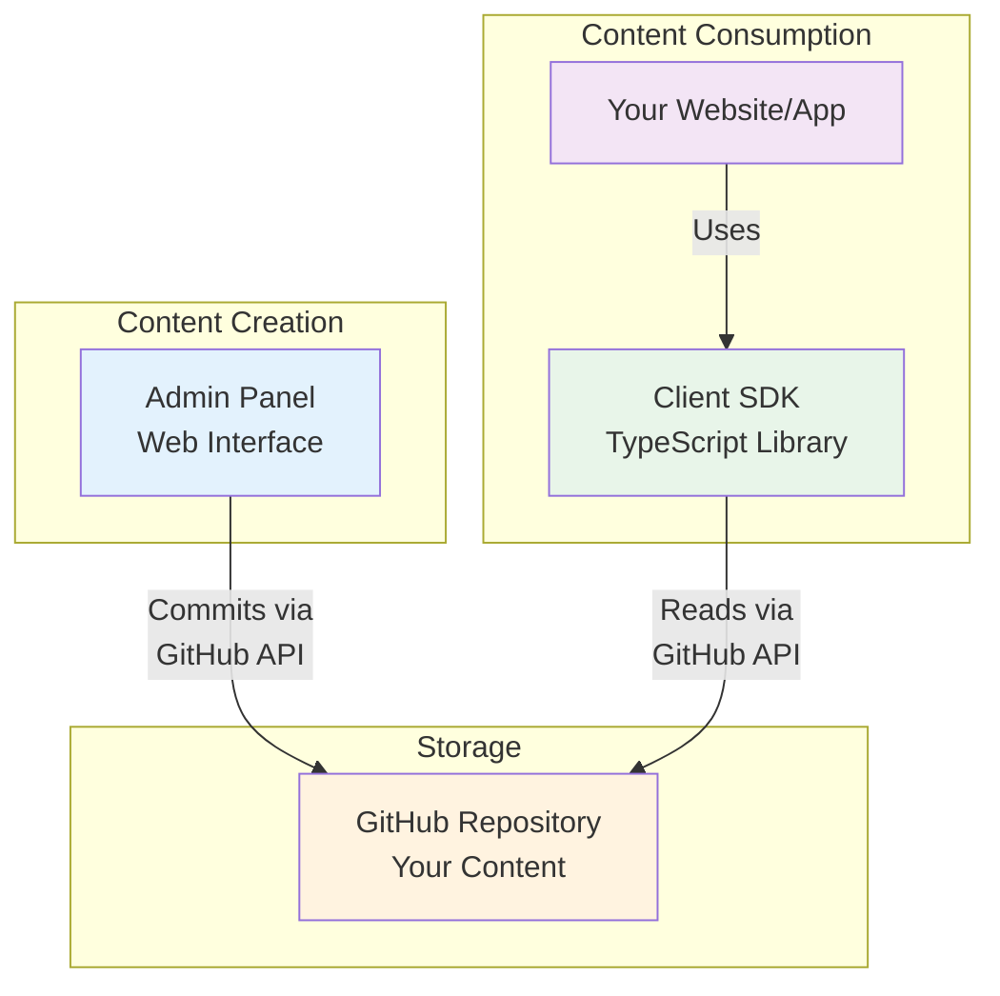
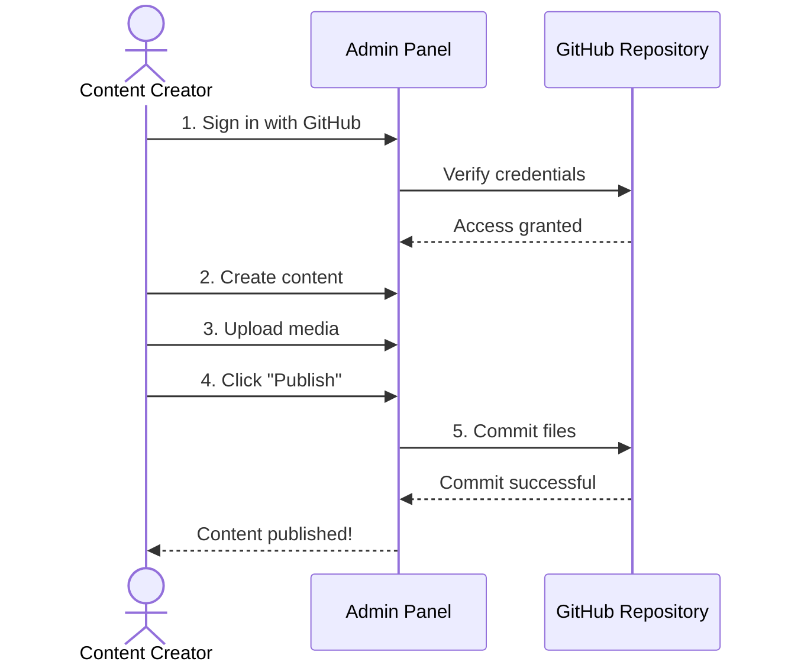
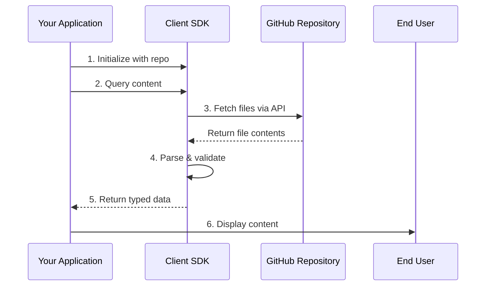
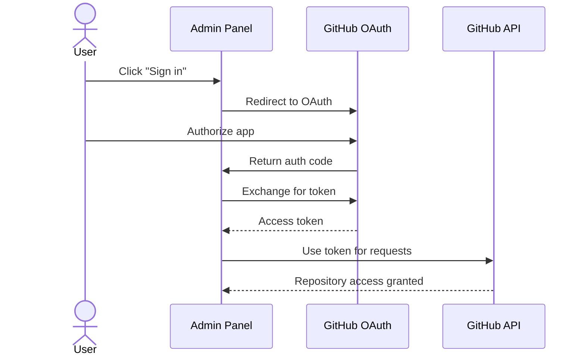
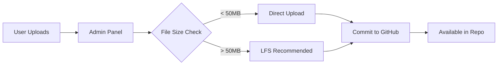
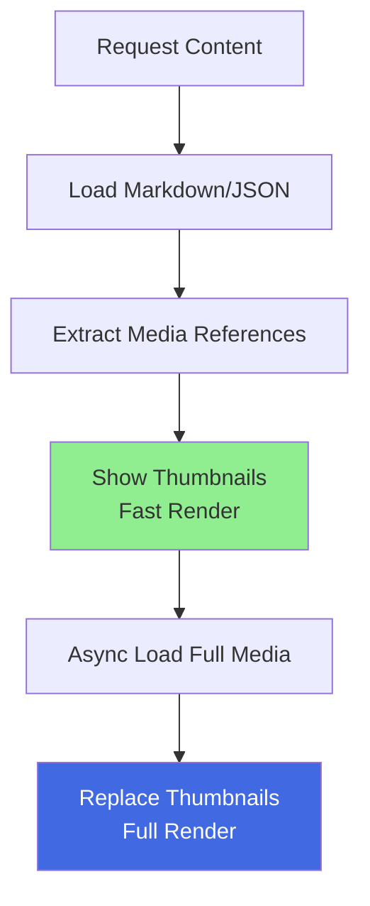
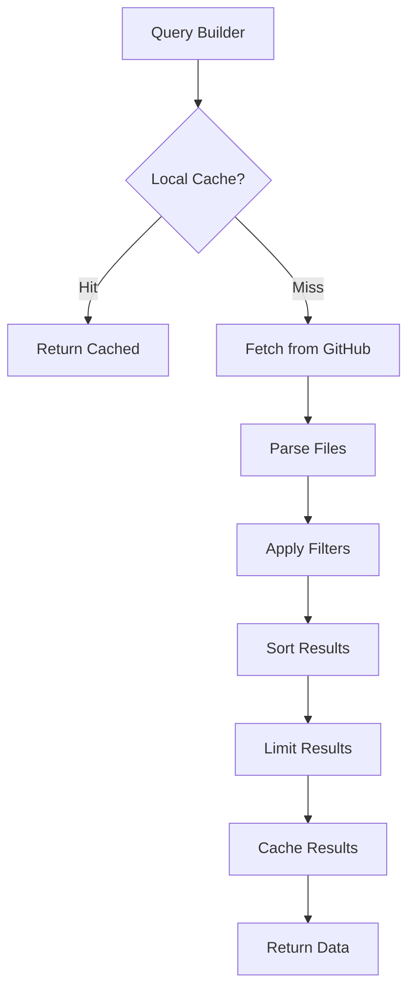
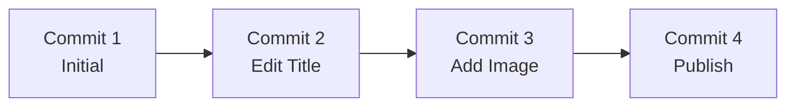

# How It Works

Understanding the GitCMS architecture and workflow.

## Architecture Overview

GitCMS uses GitHub as the single source of truth for all content. Here's how the
pieces fit together:



## Components

### 1. Admin Panel

**Purpose**: Visual content management interface

**Key Features**:

- Web-based UI (no installation)
- GitHub OAuth authentication
- Schema designer
- Rich text editor
- Media uploader

**Technology Stack**:

- Next.js (React framework)
- TipTap (rich text editor)
- TailwindCSS (styling)
- Octokit (GitHub API client)

**URL**: [gitcms-admin.bestplayer.dev](https://gitcms-admin.bestplayer.dev)

### 2. GitHub Repository

**Purpose**: Content storage and version control

**What's Stored**:

- Content files (JSON/Markdown)
- Media files (images, videos, etc.)
- Schema definitions
- Configuration

**Benefits**:

- Free hosting
- Automatic backups
- Version history
- Collaboration features
- Branch workflows

### 3. Client SDK

**Purpose**: Fetch and display content in applications

**Key Features**:

- TypeScript SDK
- SQL-like queries
- Progressive media loading
- Framework agnostic
- Type-safe API

**Technology Stack**:

- TypeScript
- Octokit (GitHub API)
- Zod (validation)

**Package**: `@git-cms/client` on npm

## Workflow

### Content Creation Flow



**Step by Step**:

1. **Authentication**: User signs in with GitHub OAuth
2. **Repository Connection**: Select and connect a repository
3. **Content Creation**: Use visual editor to create content
4. **Media Upload**: Upload images/videos as needed
5. **Publishing**: Click publish to commit to GitHub

### Content Consumption Flow



**Step by Step**:

1. **Initialization**: Configure SDK with repository details
2. **Query**: Request specific content with filters
3. **Fetch**: SDK fetches from GitHub API
4. **Parse**: Content is parsed and validated
5. **Return**: Type-safe data returned to app
6. **Display**: App renders content for users

## Data Flow

### Writing Content

```
┌─────────────┐
│ Content     │
│ Creator     │
└──────┬──────┘
       │
       ▼
┌─────────────────────────────────┐
│ Admin Panel UI                  │
│ ┌─────────────────────────────┐ │
│ │ Rich Text Editor            │ │
│ │ Media Uploader              │ │
│ │ Form Fields                 │ │
│ └─────────────────────────────┘ │
└──────┬──────────────────────────┘
       │ GitHub API (Authenticated)
       ▼
┌─────────────────────────────────┐
│ GitHub Repository               │
│                                 │
│ content/posts/my-post.md        │
│ media/images/hero.jpg           │
│ .gitcms/schemas/post.json       │
└─────────────────────────────────┘
```

### Reading Content

```
┌─────────────────────────────────┐
│ GitHub Repository               │
│                                 │
│ content/posts/my-post.md        │
│ media/images/hero.jpg           │
└──────┬──────────────────────────┘
       │ GitHub API (Public or Auth)
       ▼
┌─────────────────────────────────┐
│ Client SDK                      │
│ ┌─────────────────────────────┐ │
│ │ Query Parser                │ │
│ │ Data Validator              │ │
│ │ Media Loader                │ │
│ └─────────────────────────────┘ │
└──────┬──────────────────────────┘
       │
       ▼
┌─────────────────────────────────┐
│ Your Application                │
│                                 │
│ Display content to users        │
└─────────────────────────────────┘
```

## Storage Structure

### Repository Layout

```
your-repository/
├── .gitcms/
│   ├── config.json              # GitCMS configuration
│   └── schemas/                 # Content type definitions
│       ├── blog-post.json      # Schema for blog posts
│       ├── project.json        # Schema for projects
│       └── page.json           # Schema for pages
│
├── content/                     # All content files
│   ├── posts/                  # Blog posts
│   │   ├── 2025-11-01-hello.md
│   │   └── 2025-11-02-world.md
│   ├── projects/               # Project entries
│   │   ├── project-one.json
│   │   └── project-two.json
│   └── pages/                  # Static pages
│       ├── about.md
│       └── contact.json
│
└── media/                       # Uploaded media
    ├── images/
    │   ├── hero.jpg
    │   └── thumbnail.png
    ├── videos/
    │   └── demo.mp4
    └── documents/
        └── resume.pdf
```

### File Formats

**Markdown Files** (`.md`):

```markdown
---
title: My Blog Post
publishedAt: 2025-11-07
featured: true
---

# Hello World

This is my **first** blog post!
```

**JSON Files** (`.json`):

```json
{
  "id": "my-project",
  "title": "Awesome Project",
  "description": "A cool project",
  "url": "https://example.com",
  "featured": true
}
```

## Authentication & Security

### Admin Panel Authentication



**OAuth Permissions**:

- **Repository Access**: Read and write to your repositories
- **User Profile**: Get your basic profile information
- **Email**: Access your email address

**Security Features**:

- Tokens stored server-side only
- Encrypted session cookies
- HTTPS everywhere
- No tokens in browser

### Client SDK Authentication

**Public Repositories**:

```typescript
// No token needed!
const cms = new GitCMS({
  repository: 'username/blog',
});
```

**Private Repositories**:

```typescript
// Token required (server-side only!)
const cms = new GitCMS({
  repository: 'username/private-blog',
  token: process.env.GITHUB_TOKEN,
});
```

**Rate Limits**:

- **Public mode**: 60 requests/hour per IP
- **Authenticated mode**: 5,000 requests/hour

## Media Handling

### Upload Process



### Media Loading (Progressive)



**Two-Stage Loading**:

1. **Fast Render** (Immediate):
   - Embedded thumbnails (base64)
   - Lightweight placeholders
   - Instant page load

2. **Full Render** (Async):
   - High-resolution images
   - Actual videos
   - Progressive enhancement

## Query Processing

### Query Execution Flow



**Optimization Techniques**:

- **Caching**: Reduce API calls
- **Lazy Loading**: Fetch only what's needed
- **Progressive Queries**: Load in chunks
- **Smart Filtering**: Filter early

### Example Query Processing

```typescript
// User writes this query
const posts = await cms
  .from('posts')
  .where('metadata.status', '==', 'published')
  .where('featured', true)
  .orderBy('publishedAt', 'desc')
  .limit(5)
  .get();
```

**What happens internally**:

1. **Parse**: Build query parameters
2. **Fetch**: Get files from `content/posts/`
3. **Filter**: Apply `where` conditions
4. **Sort**: Order by `publishedAt` descending
5. **Limit**: Return top 5 results
6. **Return**: Type-safe array of posts

## Version Control Integration

### Git Workflow

Every change is a Git commit:

```bash
# When you publish content via Admin Panel
git add content/posts/new-post.md
git commit -m "Add: New blog post 'Getting Started'"
git push origin main
```

**Benefits**:

- **History**: See all changes over time
- **Revert**: Undo mistakes easily
- **Branches**: Test changes separately
- **Collaboration**: Multiple authors

### Viewing History



You can always:

- View previous versions
- Compare changes
- Revert to any point
- See who changed what

## Performance Characteristics

### Admin Panel

- **Initial Load**: ~1-2s (one-time OAuth)
- **Content Load**: ~500ms (GitHub API)
- **Content Save**: ~1-2s (commit + push)

### Client SDK

**Public Mode**:

- **Schema Fetch**: ~200-500ms
- **Content Fetch**: ~300-800ms
- **Media Thumbnails**: Instant (embedded)
- **Full Media**: ~500ms-2s (depends on size)

**Authenticated Mode**:

- Similar to public mode
- Higher rate limits (5,000/hr vs 60/hr)

**Caching Benefits**:

- **Cached**: ~10-50ms
- **Reduces**: API calls by 80-90%
- **Improves**: User experience significantly

## Scalability

### Content Limits

**GitHub Limits**:

- File size: 100MB (recommend < 10MB)
- Repository size: No hard limit (5GB recommended)
- API rate: 5,000 requests/hour (authenticated)

**Best Practices**:

- Use Git LFS for large files (> 50MB)
- Implement caching in your app
- Static generation for high traffic
- CDN for media files

### Recommended Sizes

| Content Type | Files    | Size      | Performance |
| ------------ | -------- | --------- | ----------- |
| Small Blog   | < 100    | < 50MB    | Excellent   |
| Medium Blog  | 100-500  | 50-200MB  | Very Good   |
| Large Blog   | 500-2000 | 200MB-1GB | Good        |
| Enterprise   | 2000+    | 1GB+      | Use CDN     |

## Next Steps

Now that you understand how GitCMS works:

::: info Learn More

- [Use Cases](/guide/use-cases) - See what you can build
- [Admin Guide](/admin/overview) - Start creating content
- [Client Guide](/client/overview) - Build applications

:::
