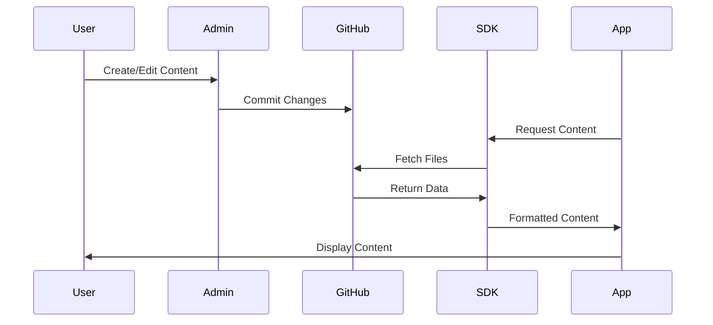

# What is GitCMS?

GitCMS is a universal content management system that uses GitHub as its backend.
It provides a beautiful web interface for managing content while storing
everything as files in your GitHub repository - **no database required**.

## Overview

GitCMS consists of two main components:

### 1. Admin Panel (For Content Creators)

A hosted web application that provides a visual interface for:

- Managing content without touching code
- Rich text editing with TipTap
- Media upload and organization
- Schema definition and management
- Version control via Git

**Access:** [gitcms-admin.bestplayer.dev](https://gitcms-admin.bestplayer.dev)

### 2. Client SDK (For Developers)

A TypeScript SDK for fetching content in your applications:

- Type-safe API
- SQL-like query syntax
- Progressive media loading
- Framework agnostic
- Works with public and private repos

**Install:** `npm install @git-cms/client`

## Key Features

### 🚀 No Database Required

All content is stored as files in your GitHub repository. This means:

- Free hosting with GitHub
- Automatic version control
- Easy backups (it's just Git!)
- No database to manage
- Full transparency

### 🎨 Universal Admin Panel

One hosted interface works for all users:

- No installation needed
- No maintenance required
- Always up-to-date
- Accessible anywhere
- Secure GitHub OAuth

### 📝 Visual Content Editor

Rich text editing powered by TipTap:

- Bold, italic, headings
- Lists and tables
- Code blocks
- Image/video embedding
- Markdown support

### 🔐 Secure & Private

- GitHub OAuth authentication
- Works with private repositories
- Token-based security
- No data stored on our servers
- You own your content

### 🖼️ Media Management

Comprehensive media support:

- Images (JPG, PNG, WebP, SVG)
- Videos (MP4, WebM, MOV)
- Audio (MP3, WAV, OGG)
- Documents (PDF, DOC, TXT)
- 3D Models (GLB, GLTF, OBJ)
- Progressive loading

### 📦 Developer-Friendly

Type-safe SDK with excellent DX:

- Full TypeScript support
- Intuitive query API
- Comprehensive documentation
- Framework agnostic
- Zero backend (for public repos)

## How It Works



1. **Content Creation**: Use the Admin Panel to create and edit content
2. **Storage**: Content is committed to your GitHub repository
3. **Retrieval**: Your app uses the SDK to fetch content
4. **Display**: Content is displayed in your application

## Who Should Use GitCMS?

### Content Creators

Perfect for those who want to:

- Manage content visually
- Avoid editing raw files
- Collaborate with version control
- Keep content in GitHub

**Examples:**

- Bloggers writing posts
- Teams managing documentation
- Marketers updating content
- Anyone preferring visual interfaces

[Learn More →](/admin/overview)

### Developers

Perfect for those building:

- Blogs and personal sites
- Documentation websites
- Portfolio sites
- Marketing pages
- Mobile apps
- Any content-driven application

**Examples:**

- Next.js websites
- React/Vue applications
- Static site generators
- Mobile apps

[Learn More →](/client/overview)

## Comparison

### GitCMS vs Traditional CMS

| Feature              | GitCMS        | WordPress        | Contentful |
| -------------------- | ------------- | ---------------- | ---------- |
| Hosting              | Free (GitHub) | Self-hosted/Paid | Paid       |
| Database             | None          | Required         | Cloud      |
| Version Control      | Native (Git)  | Plugins          | Limited    |
| Setup Time           | Minutes       | Hours            | Hours      |
| Maintenance          | Minimal       | Regular          | Managed    |
| Content Ownership    | Full          | Full             | Limited    |
| Developer Experience | Excellent     | Good             | Excellent  |

### GitCMS vs Git-Based CMS

| Feature       | GitCMS        | Netlify CMS   | Forestry    |
| ------------- | ------------- | ------------- | ----------- |
| Admin Hosting | Universal     | Self-hosted   | Cloud       |
| Installation  | None          | Required      | Required    |
| Framework     | Agnostic      | React-focused | Jekyll/Hugo |
| SDK           | Full-featured | Limited       | Limited     |
| Type Safety   | Full          | Partial       | None        |

## What Makes GitCMS Different?

### 1. Universal Admin Panel

Unlike other Git-based CMS solutions that require you to install and host the
admin interface:

- GitCMS provides one hosted admin for everyone
- No installation or configuration needed
- Always up-to-date with latest features
- Works with any repository

### 2. Developer SDK

Most Git-based CMS focus only on the admin side:

- GitCMS provides a powerful SDK for developers
- Type-safe queries
- Progressive media loading
- Framework agnostic

### 3. Zero Infrastructure

No servers, databases, or complex setup:

- Content stored in GitHub (free)
- Admin panel hosted (free)
- SDK runs client-side or server-side
- Total cost: $0

### 4. Full Type Safety

Built with TypeScript from the ground up:

- Type-safe schemas
- Type-safe queries
- Auto-completion in IDEs
- Catch errors at compile time

## Architecture

```
┌─────────────────────────────────────────────┐
│         Your GitHub Repository              │
│                                             │
│  .gitcms/                                   │
│  ├── config.json                            │
│  └── schemas/                               │
│      ├── blog-post.json                     │
│      └── project.json                       │
│                                             │
│  content/                                   │
│  ├── posts/                                 │
│  │   ├── my-first-post.md                   │
│  │   └── another-post.json                  │
│  └── projects/                              │
│      └── awesome-project.json               │
│                                             │
│  media/                                     │
│  └── images/                                │
│      └── hero.jpg                           │
└─────────────────────────────────────────────┘
         ↑                    ↑
         │                    │
    (commits)             (reads)
         │                    │
┌────────┴────────┐  ┌────────┴────────┐
│  Admin Panel    │  │   Client SDK    │
│  (Web UI)       │  │   (Your App)    │
└─────────────────┘  └─────────────────┘
```

## Getting Started

Ready to dive in? Choose your path:

::: info For Content Creators

Start creating content with the Admin Panel

[Admin Guide →](/admin/getting-started)

:::

::: info For Developers

Integrate GitCMS into your application

[Client SDK Guide →](/client/quick-start)

:::

::: info Learn More

Understand how GitCMS works

[How It Works →](/guide/how-it-works)

:::

## Community & Support

- **GitHub**:
  [BestPlayerMMIII/GitCMS](https://github.com/BestPlayerMMIII/GitCMS)
- **Issues**:
  [Report bugs or request features](https://github.com/BestPlayerMMIII/GitCMS/issues)
- **Discussions**:
  [Ask questions and share ideas](https://github.com/BestPlayerMMIII/GitCMS/discussions)

## License

GitCMS is
[MIT licensed](https://github.com/BestPlayerMMIII/GitCMS/blob/main/LICENSE).
