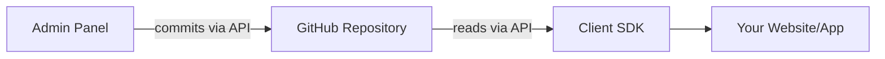

## Quick Start

### For Content Creators

Visit the [Admin Panel](https://gitcms-admin.bestplayer.dev) to start managing
your content visually:

1. Sign in with GitHub
2. Connect your repository
3. Define content schemas
4. Create and publish content

[Learn More →](/admin/getting-started)

### For Developers

Install the SDK and start fetching content in minutes:

```bash
npm install @git-cms/client
```

```typescript
import { GitCMS } from '@git-cms/client';

const cms = new GitCMS({
  repository: 'username/my-blog',
});

// Fetch published posts
const posts = await cms
  .from('posts')
  .where('metadata.status', '==', 'published')
  .orderBy('metadata.publishedAt', 'desc')
  .get();
```

[Learn More →](/client/quick-start)

## How It Works



GitCMS uses GitHub as the storage backend. The admin panel writes content to
your repository, and the client SDK reads it back. Everything is
version-controlled and backed by GitHub's infrastructure.

## Use Cases

::: info Blog Management

Perfect for managing blog posts with a visual editor, media uploads, and
built-in version control.

:::

::: info Documentation Sites

Keep documentation current with an easy editor, Markdown support, and structured
content workflows.

:::

::: info Portfolio Projects

Showcase your work with rich media, flexible content schemas, and customizable
layouts.

:::

::: info App Configuration

Manage app settings, feature flags, and announcements from the dashboard — no
deployments required.

:::

## What Makes GitCMS Different?

- **No Infrastructure** - No databases, no servers to maintain
- **Git-Powered** - Full version history, branches, and collaboration
- **Universal** - One admin panel for all users and repositories
- **Developer-Friendly** - Type-safe SDK with excellent DX
- **Open Source** - MIT licensed, fully transparent

## Ready to Start?

<div class="vp-doc" style="margin-top: 2rem;">
  <a href="/guide/getting-started" class="vp-button brand" style="margin-right: 1rem;">Get Started</a>
  <a href="/admin/overview" class="vp-button alt" style="margin-right: 1rem;">Admin Guide</a>
  <a href="/client/overview" class="vp-button alt">SDK Guide</a>
</div>
